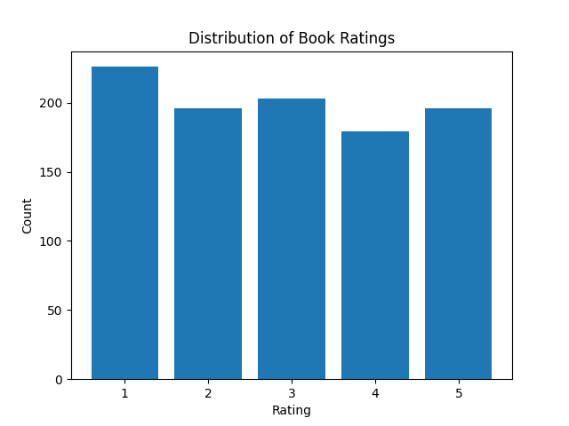
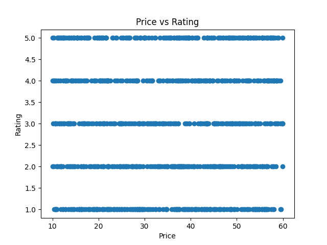

# Web Scraping and Data Visualization Project

## Project Overview

This project demonstrates web scraping, data cleaning, and data visualization using Python.

The application extracts:
- Book information (title, price, rating)
- Quotes information (text, author, tags)

The collected data is stored in CSV format and analyzed using Pandas.
Various visualizations are generated using Matplotlib to explore data distribution and relationships.

## Technologies

- Python 3.x
- BeautifulSoup4
- Requests
- Pandas
- Matplotlib

## 📊 Example Visualizations

### Distribution of Book Ratings

### Price vs Rating

